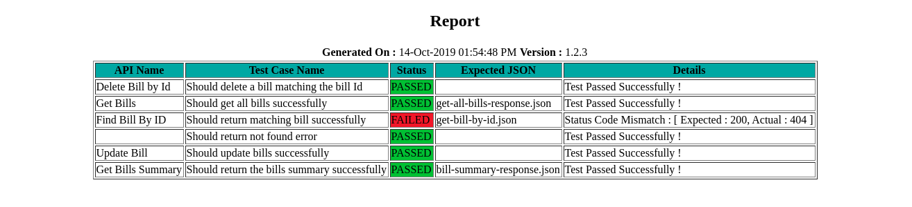
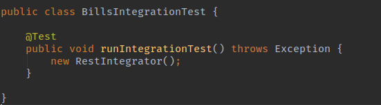

# REST Integration
Makes Integration Testing REST APIs easier. It helps in testing REST APIs using Declarative approach and not Imperative one.

## Introduction
Mostly when we are testing REST APIs we use Imperative approach. Imperative approach means for testing any REST APIs we 
write test cases using REST Client. The REST Client helps us making REST calls then we perform Assertions whether the
Response matches Expected Response. When we do so we write each and every test case explaining what the code should do.
Its more crude way of doing things. Being impressed by the talks of Venkat Subramaniam about Declarative and
Imperative Style of Programming, I came up with this idea. I try to apply the concept to everything possible. Declarative 
approach is when we tell WHAT needs to be done and Imperative approach is when we tell HOW to do it. Similarly rest-integ 
is more about write test cases in a way which tells WHAT needs to be done. The code is implemented in a way that takes care
of HOW to do it.

### Components
The rest-integ consists of below components :

* rest-integ.yml : Its the main configuration file which explains what needs to be done. It consists of APIs declaration
and Base Path definition. Different test cases and there expected outcomes. The file should be placed in the
src/test/resources folder. Check below sample rest-integ.yml.

* request.json : A request json file contains the JSON format request body if we need to pass on to an API. Its optional
since not all APIs need a Request Body. All the request.json files should be placed in the src/test/resources/requests
package. Ideally you need to create a <b>requests</b> folder in src/test/resource folder.

* response.json : Most of the APIs have a response body. We need to perform assertions with the actual response received
and expected response. Hence we should create a response.json body for the test case when you have some response body 
received from an API and would like to assert the same. Its also optional since not all APIs have a response body.

* RestIntegrator.java : Its the main entry point. The Java class invokes all the test cases defined in the rest-integ.yml.
Currently rest-integ is in nascent stage hence you will have to create an instance of this class in an empty test case so
that it invokes the test cases. Easy integration of this into well known testing frameworks is in progress.

* HTML Reports : Currently as basic HTML reporting is supported in rest-integ. The report shows what all APIs were invoked
and test cases run with their output.

### rest-integ.yml
Same rest-integ.yml is shown below. Its self explanatory for those who already know YAML config.

```
ServiceName: REST Integrator
Version: 1.2.3
BasePath: http://localhost:8080/home-automation/api

APIS:
  - name: Find Bill By ID
    path: /bills/{id}
    method: GET
    tests:
      - name: Should return matching bill successfully
        request:
          pathParams:
            id: 5cb0e8896115cb3447077259
        response:
          body: get-bill-by-id.json
          status: 200
      - name: Should return not found error
        request:
          pathParams:
            id: abc
        response:
          status: 404

  - name: Get Bills
    path: /bills
    method: GET
    tests:
      - name: Should get all bills successfully
        request:
          responseIsList: true
        response:
          body: get-all-bills-response.json
          status: 200

  - name: Get Bills Summary
    path: /bills/summary
    method: GET
    tests:
      - name: Should return the bills summary successfully
        response:
          body: bill-summary-response.json
          status: 200

  - name: Update Bill
    path: /bills
    method: PUT
    tests:
      - name: Should update bills successfully
        request:
          body: update-bill-request.json
        response:
          status: 204

  - name: Delete Bill by Id
    path: /bills/{id}
    method: DELETE
    tests:
      - name: Should delete a bill matching the bill Id
        request:
          pathParams:
            id: 5cb0e8f06115cb35417ca6ed
        response:
          status: 200

  - name: Add Bill
    path: /bills
    method: POST
    tests:
      - name: Should add all bills successfully
        request:
          body: add-bill-request.json
        response:
          status: 200
```

### Sample HTML Report
A screenshot of sample HTML Report which is very basic is attached below :


### Simple Invocation
Currently the project is in nascent stage hence the integration with known testing framework is not done. Hence we have 
a patchy way of configuring the runner.



### Contact
You have any suggestions and improvement ideas then reach out to me on below contact details

<b>Email :</b> <a href="mailto:muley.anand66@gmail.com">muley.anand66@gmail.com</a> <br/>
<b>LinkedIn :</b> [anand-muley-77864534](https://www.linkedin.com/in/anand-muley-77864534)